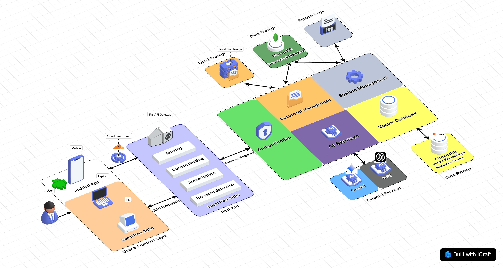

[](https://deepwiki.com/xu5546223/sortify)

# Sortify AI Assistant / Sortify AI 智能助手

[English](#english-version) | [中文](#chinese-version)

---

<a id="chinese-version"></a>

## 📖 項目概述

Sortify AI Assistant 是一個功能強大的智能文件分析和問答系統，基於先進的向量資料庫和大型語言模型技術。系統能夠自動提取、分析文檔內容，並提供基於文件內容的智能問答服務，為使用者提供高效且精確的文檔理解和交互體驗。

## ✨ 主要功能

- 📄 **文件上傳與處理**：支援 PDF、Word、圖片等多種格式文件上傳和文字提取
- 🤖 **AI 智能分析**：自動分析文件內容，生成摘要、關鍵詞和分類
- 🔍 **語義搜索**：基於向量資料庫的高效語義搜索，快速找到相關文件
- 💬 **智能問答**：針對文件內容的 AI 輔助問答系統
- 📱 **多設備同步**：透過手機和電腦同步存取和管理文件
- 📊 **數據可視化**：提供文件分析報表和統計圖表
- 🔐 **用戶認證**：安全的用戶登入和權限管理系統

## 🏗️ 系統架構

**技術棧:**

| 組件     | 技術                                           | 描述                       |
| -------- | ---------------------------------------------- | -------------------------- |
| 前端     | React.js + TypeScript + Ant Design + TailwindCSS | 現代化響應式用戶界面       |
| 後端     | FastAPI (Python)                               | 高性能異步 API 服務        |
| 資料庫   | MongoDB + ChromaDB                             | 文檔存儲 + 向量搜索        |
| AI 服務  | Google Gemini / OpenAI API                     | 大型語言模型集成           |

以下是我們系統的架構圖：



## 🚀 快速開始

### 📋 環境要求

- Node.js 18+
- Python 3.13+
- MongoDB

### 💻 本地開發

**前端開發:**
```bash
# 進入前端目錄
cd frontend

# 安裝依賴
npm install

# 啟動開發伺服器
npm start
```

**後端開發:**
```bash
# 進入後端目錄
cd backend

# 創建虛擬環境
python -m venv .venv

# 啟動虛擬環境
# Windows
.venv\\Scripts\\activate
# Linux/Mac
source .venv/bin/activate

# 安裝依賴
pip install -r requirements.txt

# 複製環境變數範本
cp example.env .env
# 編輯 .env 檔案，填入您的配置

# 啟動開發伺服器
uvicorn app.main:app --reload
```

## 📁 項目結構

```
sortify/
├── frontend/                 # 前端項目
│   ├── public/              # 靜態資源
│   ├── src/                 # 源代碼
│   │   ├── components/      # UI 組件
│   │   ├── pages/           # 頁面組件
│   │   │   ├── auth/        # 認證頁面
│   │   │   ├── DashboardPage.tsx    # 儀表板
│   │   │   ├── DocumentsPage.tsx    # 文件管理
│   │   │   ├── AIQAPage.tsx         # AI問答
│   │   │   └── VectorDatabasePage.tsx # 向量數據庫管理
│   │   ├── services/        # API 服務
│   │   └── contexts/        # React 上下文
│   ├── package.json         # 依賴配置
├── backend/                 # 後端項目
│   ├── app/                 # 應用程式
│   │   ├── apis/           # API 路由
│   │   │   └── v1/         # V1 API 版本
│   │   ├── core/           # 核心功能
│   │   ├── models/         # 資料模型
│   │   ├── services/       # 業務邏輯
│   │   └── main.py         # 應用入口
│   ├── tests/              # 測試文件
│   └── pyproject.toml      # Python 項目配置
```

## 🔧 配置說明

### 環境變數

**後端配置:**
- `MONGODB_URL`: MongoDB 連接字串
- `DB_NAME`: 資料庫名稱
- `OPENAI_API_KEY`: OpenAI API 密鑰
- `GEMINI_API_KEY`: Google Gemini API 密鑰

## 📊 API 文檔

系統啟動後，您可以通過以下地址訪問 API 文檔：
- **Swagger UI**: `http://localhost:8000/docs`
- **ReDoc**: `http://localhost:8000/redoc`

**主要 API 端點:**
- `/api/v1/auth/` - 用戶認證
- `/api/v1/dashboard/` - 儀表板數據
- `/api/v1/logs/` - 系統日誌
- `/api/v1/vector-db/` - 向量資料庫操作
- `/api/v1/unified-ai/` - 統一 AI 服務
- `/api/v1/embedding/` - 嵌入模型服務

## 🧪 測試

**後端測試:**
```bash
cd backend
pytest tests/
```

**資料庫連接測試:**
訪問 `http://localhost:8000/test-db-connection` 來測試 MongoDB 連接狀態。

## 🤝 貢獻指南

歡迎提交 Pull Request 和 Issue！請確保您的代碼符合項目的編碼標準。

## 📄 授權協議

本項目採用 MIT 授權協議。詳見 LICENSE 文件。

## 📞 聯繫方式

如有問題或建議，請通過 GitHub Issues 聯繫我們。

---

<a id="english-version"></a>

## 📖 Project Overview

Sortify AI Assistant is a powerful intelligent document analysis and Q&A system based on advanced vector database and large language model technologies. The system can automatically extract and analyze document content, providing intelligent Q&A services based on file content, offering users efficient and accurate document understanding and interaction experiences.

## ✨ Key Features

- 📄 **File Upload & Processing**: Support for uploading and text extraction from multiple formats including PDF, Word, images
- 🤖 **AI Intelligent Analysis**: Automatic analysis of document content, generating summaries, keywords, and classifications
- 🔍 **Semantic Search**: Efficient semantic search based on vector database to quickly find relevant documents
- 💬 **Intelligent Q&A**: AI-assisted Q&A system for document content
- 📱 **Multi-device Sync**: Synchronous access and management of files across mobile and desktop devices
- 📊 **Data Visualization**: Document analysis reports and statistical charts
- 🔐 **User Authentication**: Secure user login and permission management system

## 🏗️ System Architecture

**Tech Stack:**

| Component  | Technology                                     | Description                        |
| ---------- | ---------------------------------------------- | ---------------------------------- |
| Frontend   | React.js + TypeScript + Ant Design + TailwindCSS | Modern responsive UI               |
| Backend    | FastAPI (Python)                               | High-performance async API service |
| Database   | MongoDB + ChromaDB                             | Document storage + Vector search   |
| AI Service | Google Gemini / OpenAI API                     | LLM integration                    |

"Here is our system's architecture diagram:"


## 🚀 Quick Start

### 📋 Prerequisites

- Node.js 18+
- Python 3.13+
- MongoDB

### 💻 Local Development

**Frontend Development:**
```bash
# Enter frontend directory
cd frontend

# Install dependencies
npm install

# Start development server
npm start
```

**Backend Development:**
```bash
# Enter backend directory
cd backend

# Create virtual environment
python -m venv .venv

# Activate virtual environment
# Windows
.venv\\Scripts\\activate
# Linux/Mac
source .venv/bin/activate

# Install dependencies
pip install -r requirements.txt

# Copy environment variable template
cp example.env .env
# Edit .env file and fill in your configuration

# Start development server
uvicorn app.main:app --reload
```

## 📁 Project Structure

```
sortify/
├── frontend/                 # Frontend project
│   ├── public/              # Static assets
│   ├── src/                 # Source code
│   │   ├── components/      # UI components
│   │   ├── pages/           # Page components
│   │   │   ├── auth/        # Authentication pages
│   │   │   ├── DashboardPage.tsx    # Dashboard
│   │   │   ├── DocumentsPage.tsx    # Document management
│   │   │   ├── AIQAPage.tsx         # AI Q&A
│   │   │   └── VectorDatabasePage.tsx # Vector DB management
│   │   ├── services/        # API services
│   │   └── contexts/        # React contexts
│   ├── package.json         # Dependencies
├── backend/                 # Backend project
│   ├── app/                 # Application
│   │   ├── apis/           # API routes
│   │   │   └── v1/         # V1 API version
│   │   ├── core/           # Core functionality
│   │   ├── models/         # Data models
│   │   ├── services/       # Business logic
│   │   └── main.py         # Application entry point
│   ├── tests/              # Test files
│   └── pyproject.toml      # Python project config
```

## 🔧 Configuration

### Environment Variables

**Backend Configuration:**
- `MONGODB_URL`: MongoDB connection string
- `DB_NAME`: Database name
- `OPENAI_API_KEY`: OpenAI API key
- `GEMINI_API_KEY`: Google Gemini API key

## 📊 API Documentation

After starting the system, you can access the API documentation at:
- **Swagger UI**: `http://localhost:8000/docs`
- **ReDoc**: `http://localhost:8000/redoc`

**Main API Endpoints:**
- `/api/v1/auth/` - User authentication
- `/api/v1/dashboard/` - Dashboard data
- `/api/v1/logs/` - System logs
- `/api/v1/vector-db/` - Vector database operations
- `/api/v1/unified-ai/` - Unified AI services
- `/api/v1/embedding/` - Embedding model services

## 🧪 Testing

**Backend Testing:**
```bash
cd backend
pytest tests/
```

**Database Connection Test:**
Visit `http://localhost:8000/test-db-connection` to test MongoDB connection status.

## 🤝 Contributing

Welcome to submit Pull Requests and Issues! Please ensure your code follows the project\'s coding standards.

## 📄 License

This project is licensed under the MIT License. See the LICENSE file for details.

## 📞 Contact

For questions or suggestions, please contact us through GitHub Issues.

---
